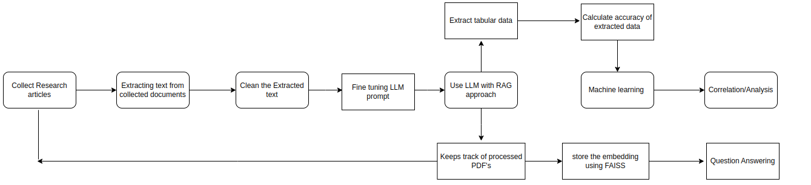

# LLM-Enhanced-Data-Extraction-and-QA

This repository facilitates efficient extraction, analysis, and question answering of tabular data from research articles using large language models (LLMs) like GPT-3.5-turbo-16k and GPT-4.

## Tabular Data Extraction

The `Tabular_data_extraction.py` script extracts tabular data from research articles using LLM models. It handles both editable and non-editable PDFs, utilizing fine-tuning prompts where applicable. Key features include:

- Extracting text from PDFs.
- Calculating overall token costs (input, output, and prompt tokens).
- Dividing the text into chunks for processing.
- Storing extracted data in `.txt` and `.json` formats.
- Processing only unprocessed PDF files, ensuring efficiency.

## Accuracy Testing

The `accuracy_test.py` script tests the accuracy of tabular data extraction by comparing the extracted data with the original PDF content. It evaluates the performance of GPT-3.5-turbo-16k and GPT-4 models, with and without fine-tuning prompts. Results are plotted for visual inspection.

## Question Answering

The `question_answering.py` script processes a collection of research papers using the RAG (Retrieval-Augmented Generation) approach. Key features include:

- Gathering and cleaning research papers (e.g., removing reference sections).
- Formatting papers for question answering using GPT-3.5 and GPT-4.
- Generating document-based responses tailored to the specific domain.
- Each generated response also references the title and DOI of the source paper from where it actually extracted the response.
- Creating and storing embeddings efficiently using FAISS to track processed PDFs.

This repository provides a comprehensive toolkit for extracting, analyzing, and retrieving information from research articles.
